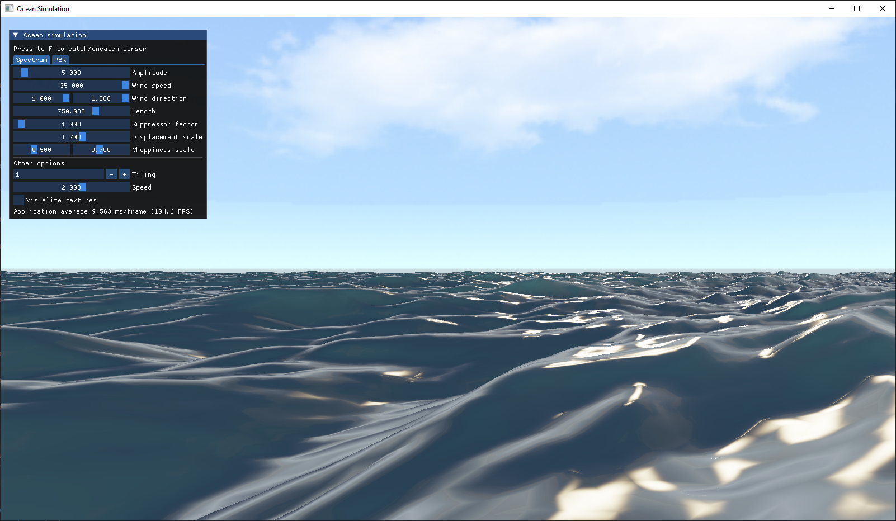
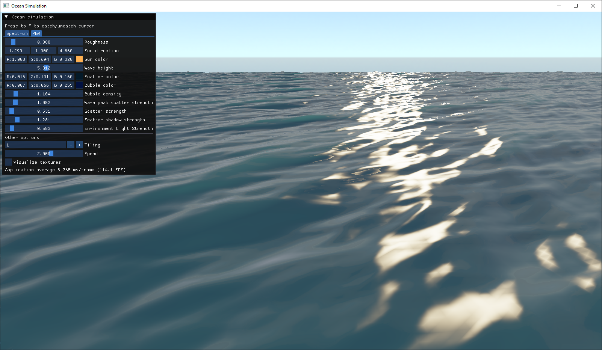

# Ocean simulation 🌊

Ocean simulation implemented using OpenGL and c++. Based on Tessendorf's article "Simulating Ocean Water", Acerola's videos, and Atlus' GDC talk "Wakes, Explosions and Lighting: Interactive Water Simulation in Atlus"

Currently, it's using the Phillips spectrum, but I plan to change it to the JONSWAP spectrum. Features I may add someday: foam, small particles to simulate spray, and a simple buoy/ship simulation.

For the FFT calculation I'm using the GLFFT library.

Skybox texture by Chad Wolfe: https://opengameart.org/content/sky-box-sunny-day

## Examples




## Requirements
- G++ compiler on Windows. MacOS is not supported due to compute shaders in OpenGL not supported. 
- C++ 20 support
- CMake >= 3.27
- OpenGL 4.3 support

## Clone
```git
git clone --recurcive https://github.com/GGryg/ocean-simulation.git 
```

## Build
```cmd
mkdir  build
cd build
cmake ..
cmake --build .
```
